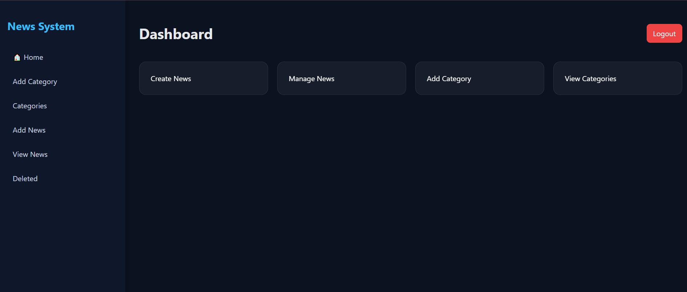

# 🚀 News Management System

A PHP & MySQL-based News Management System with full CRUD operations, authentication, and image upload functionality.

---

## 🧱 Technologies Used

- 🐘 PHP (Backend logic)
- 🗄️ MySQL (Database)
- 🌐 HTML5 (Structure)
- 🎨 CSS3 (Styling)
- ⚡ JavaScript (Interactions)
- 🧰 XAMPP (Local server)

---

## 📌 Future Improvements

- Add search functionality for faster news filtering  
- Implement pagination for large datasets  
- Improve UI with animations and transitions  
- Add role-based admin access control  
- Upgrade project to Laravel framework  

---

## 🎯 Project Purpose

This system was built to simplify managing news content through a structured admin dashboard with secure authentication and organized data handling.

---

## 📂 Project Structure

```text
config/           → Database connection
images/           → Uploaded images
header.php        → Layout header
footer.php        → Layout footer
dashboard.php     → Admin panel
add_news.php      → Create news
view_news.php     → Display news
add_category.php  → Manage categories
login.php         → User login
register.php      → User registration
```
 
---

## 🗄️ Database Setup

1. Open phpMyAdmin
2. Create a database named:

```text
news_db
```

3. Import the file:

```text
database.sql
```

4. Run the project

---

## 🖼️ Screenshots




---

## ⚙️ How to Run the Project

1. Install **XAMPP**
2. Start **Apache & MySQL**

3. Move project folder to:

```text
C:\xampp\htdocs\news-system
```

4. Open browser and run:

```text
http://localhost/news-system/register.php
```

---

## 👩‍💻 Developer

- Name: **Raghad Haniya**  
- Project Type: University Web Development Project  
- Stack: PHP + MySQL + Frontend  

---

## 📌 Future Improvements

- Add search functionality  
- Add pagination for news  
- Improve UI with animations  
- Add admin roles system  
- Convert to Laravel in future  

---

## ⭐ Note

This project is built for learning purposes and demonstrates full CRUD operations, authentication system, and file upload handling.

---

